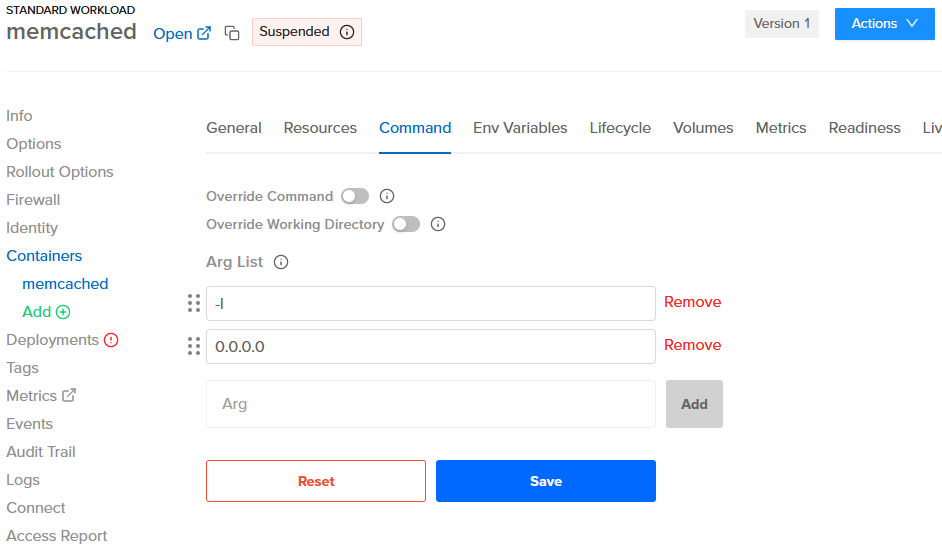
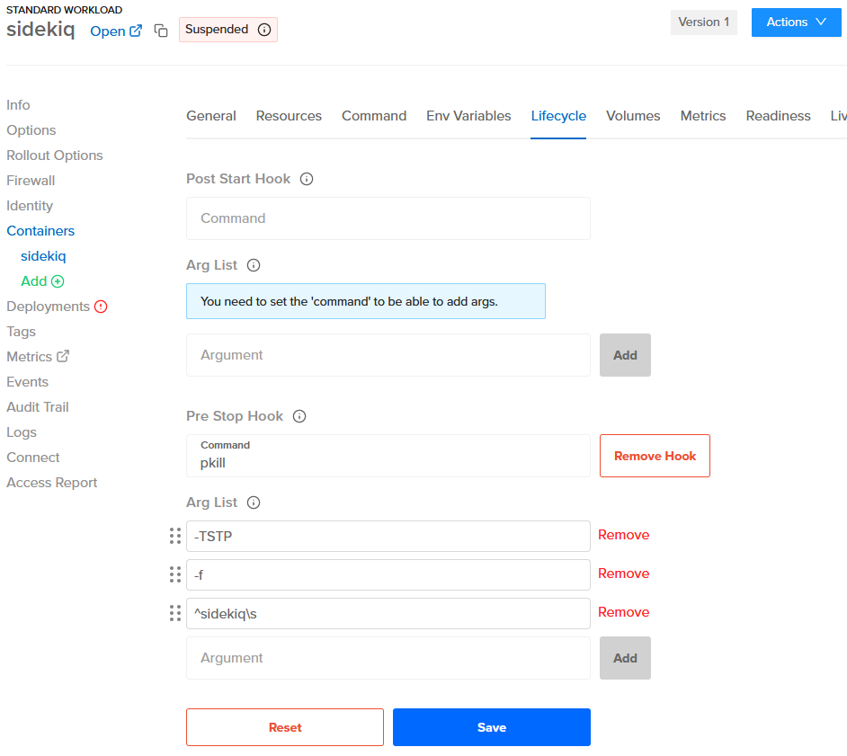

# Tips

1. [GVCs vs. Orgs](#gvcs-vs-orgs)
2. [RAM](#ram)
4. [Remote IP](#remote-ip)
5. [Secrets](#secrets)
6. [CI](#ci)
7. [Memcached](#memcached)
8. [Sidekiq](#sidekiq)
   - [Quieting Non-Critical Workers During Deployments](#quieting-non-critical-workers-during-deployments)
   - [Setting Up a Pre Stop Hook](#setting-up-a-pre-stop-hook)
   - [Setting Up a Liveness Probe](#setting-up-a-liveness-probe)
9. [Useful Links](#useful-links)

## GVCs vs. Orgs

- A "GVC" roughly corresponds to a Heroku "app".
- Images are available at the org level.
- Multiple GVCs within an org can use the same image.
- You can have different images within a GVC and even within a workload. This flexibility one of the key differences compared to Heroku apps.

## RAM

If the max memory is reached for any workload replica, the replica is terminated and restarted. You can configure alerts
for workload restarts and percentage of memory used in the Control Plane UX via the following steps:
1. Navigate to the workload.
2. Click "Metrics" on the left menu to get into Grafana
3. TBD - get details from ControlPlane Staff

## Remote IP

The actual remote IP of the workload container is in the 127.0.0.x network, so that will be set as the `REMOTE_ADDR` env
var.

However, Control Plane additionally sets the `x-forwarded-for` and `x-envoy-external-address` headers (and others - see:
https://docs.controlplane.com/concepts/security#headers). On Rails, the `ActionDispatch::RemoteIp` middleware should
pick those up and automatically populate `request.remote_ip`.

So `REMOTE_ADDR` should not be used directly, only `request.remote_ip`.

## ENV values
ENV values used by a container (within a workload) can be stored within CPLN at the following levels:
1. Workload-Container
2. GVC

For your "review apps," it is convenient to have simple ENV's stored in plain text in your source code. You will want to keep some ENV's, like the Rails `SECRET_KEY_BASE` out of your source code. For staging and production apps, you will set these values directly at the GVC or workload levels, so none of these ENV values are committed to source code.

For the storage of ENVs in the source code, we can use a level of indirection so that you can store an ENV value in your source code like `cpln://secret/my-app-review-env-secrets.SECRET_KEY_BASE` and then have the secret value stored at the org level, which applies to your GVC's mapped to that org.

Here is how you do this:

1. In the upper left "Manage Org" menu, click on "Secrets"
1. Create a secret with `Secret Type: Dictionary` (e.g., `my-secrets`) and add the secret env vars there
2. Create an identity and assign it to the target workload
3. Create a policy with `Target Kind: Secret` and grant `reveal` permission to the identity created
4. Use `cpln://secret/...` in the app to access the secret env vars (e.g., `cpln://secret/my-secrets.SOME_VAR`)

## CI

**Note:** Docker builds are much slower on Apple Silicon, so try to configure CI to build the images if using Apple
hardware.

On CI, make sure to create a profile before running any `cpln` or `cpl` commands.

```sh
CPLN_TOKEN=...
cpln profile create default --token ${CPLN_TOKEN}
```

Also, make sure to login to the Control Plane Docker repository if building and pushing an image.

```sh
cpln image docker-login
```

## Memcached

On the workload container for Memcached (using the `memcached:alpine` image), make sure that the command is configured
with the args `-l 0.0.0.0`.



## Sidekiq

### Quieting Non-Critical Workers During Deployments

To avoid locks in migrations, we can quiet non-critical workers during deployments. Doing this early enough in the CI
gives time for all workers to finish jobs gracefully before the new image is deployed.

There's no need to un-quiet the workers, as that will happen automatically after the new image is deployed.

```sh
cpl run 'rails runner "Sidekiq::ProcessSet.new.each { |w| w.quiet! unless w[%q(hostname)].start_with?(%q(criticalworker.)) }"' -a my-app
```

### Setting Up a Pre Stop Hook

By setting up a pre stop hook in the lifecycle of the workload container for Sidekiq, which sends "QUIET" to the workers,
we can ensure that all workers will finish jobs grafecully before the replica is actually stopped by Control Plane. This
also works nicely for multiple replicas.

A couple notes:

- we can't use the process name as regex, because it's Ruby, not Sidekiq
- we need to add a space after `sidekiq`, otherwise it sends `TSTP` to the `sidekiqswarm` process as well, and for some
  reason that doesn't work

So with `^` and `\s`, we guarantee that it's sent only to worker processes.

```sh
pkill -TSTP -f ^sidekiq\s
```



### Setting Up a Liveness Probe

To set up a liveness probe on port 7433, see: https://github.com/arturictus/sidekiq_alive

## Useful Links

- For best practices for the app's Dockerfile, see: https://lipanski.com/posts/dockerfile-ruby-best-practices
- For migrating from Heroku Postgres to RDS, see: https://pelle.io/posts/hetzner-rds-postgres
# Tips

1. [GVCs vs. Orgs](#gvcs-vs-orgs)
2. [RAM](#ram)
4. [Remote IP](#remote-ip)
5. [Secrets](#secrets)
6. [CI](#ci)
7. [Memcached](#memcached)
8. [Sidekiq](#sidekiq)
   - [Quieting Non-Critical Workers During Deployments](#quieting-non-critical-workers-during-deployments)
   - [Setting Up a Pre Stop Hook](#setting-up-a-pre-stop-hook)
   - [Setting Up a Liveness Probe](#setting-up-a-liveness-probe)
9. [Useful Links](#useful-links)

## GVCs vs. Orgs

- A "GVC" roughly corresponds to a Heroku "app".
- Images are available at the org level.
- Multiple GVCs within an org can use the same image.
- You can have different images within a GVC and even within a workload. This flexibility one of the key differences compared to Heroku apps.

## RAM

If the max memory is reached for any workload replica, the replica is terminated and restarted. You can configure alerts
for workload restarts and percentage of memory used in the Control Plane UX via the following steps:
1. Navigate to the workload.
2. Click "Metrics" on the left menu to get into Grafana
3. TBD - get details from ControlPlane Staff

## Remote IP

The actual remote IP of the workload container is in the 127.0.0.x network, so that will be set as the `REMOTE_ADDR` env
var.

However, Control Plane additionally sets the `x-forwarded-for` and `x-envoy-external-address` headers (and others - see:
https://docs.controlplane.com/concepts/security#headers). On Rails, the `ActionDispatch::RemoteIp` middleware should
pick those up and automatically populate `request.remote_ip`.

So `REMOTE_ADDR` should not be used directly, only `request.remote_ip`.

## ENV values
ENV values used by a container (within a workload) can be stored within CPLN at the following levels:
1. Workload-Container
2. GVC

For your "review apps," it is convenient to have simple ENVs stored in plain text in your source code. You will want to keep some ENV's, like the Rails `SECRET_KEY_BASE`, out of your source code. You will set these values directly at the GVC or workload levels for staging and production apps, so none of these ENV values are committed to the source code.

For the storage of ENVs in the source code, we can use a level of indirection so that you can store an ENV value in your source code like `cpln://secret/my-app-review-env-secrets.SECRET_KEY_BASE` and then have the secret value stored at the org level, which applies to your GVC's mapped to that org.

Here is how you do this:

1. In the upper left "Manage Org" menu, click on "Secrets"
1. Create a secret with `Secret Type: Dictionary` (e.g., `my-secrets`) and add the secret env vars there
2. Create an GVC "identity" (GVC menu). It only needs a name. Next, assign that "identity" to the target workload, using the "identity" menu for the workload.
3. Create a new policy at the top level (lower left menu) "Access Control" level with `Target Kind:` as `Secret`. Click "Next" and then click the checkbox for your secrets dictionary. Then click "Next." Then click "Add Binding." Then click permission "reveal." Click the tab "Identities." Select the identity that you created in step 2. Then click "Add." Then click "Create."
4. Use a value like `cpln://secret/my-app-review-env-secrets.SECRET_KEY_BASE` at either the GVC or workload container ENV settings to access the secret env vars. Then these values are injected automatically when the containers start.

## CI

**Note:** Docker builds are much slower on Apple Silicon, so try to configure CI to build the images if using Apple
hardware.

On CI, make sure to create a profile before running any `cpln` or `cpl` commands.

```sh
CPLN_TOKEN=...
cpln profile create default --token ${CPLN_TOKEN}
```

Also, make sure to login to the Control Plane Docker repository if building and pushing an image.

```sh
cpln image docker-login
```

## Memcached

On the workload container for Memcached (using the `memcached:alpine` image), make sure that the command is configured
with the args `-l 0.0.0.0`.


## Sidekiq

### Quieting Non-Critical Workers During Deployments

To avoid locks in migrations, we can quiet non-critical workers during deployments. Doing this early enough in the CI
gives time for all workers to finish jobs gracefully before the new image is deployed.

There's no need to un-quiet the workers, as that will happen automatically after the new image is deployed.

```sh
cpl run 'rails runner "Sidekiq::ProcessSet.new.each { |w| w.quiet! unless w[%q(hostname)].start_with?(%q(criticalworker.)) }"' -a my-app
```

### Setting Up a Pre Stop Hook

By setting up a pre stop hook in the lifecycle of the workload container for Sidekiq, which sends "QUIET" to the workers,
we can ensure that all workers will finish jobs grafecully before the replica is actually stopped by Control Plane. This
also works nicely for multiple replicas.

A couple notes:

- we can't use the process name as regex, because it's Ruby, not Sidekiq
- we need to add a space after `sidekiq`, otherwise it sends `TSTP` to the `sidekiqswarm` process as well, and for some
  reason that doesn't work

So with `^` and `\s`, we guarantee that it's sent only to worker processes.

```sh
pkill -TSTP -f ^sidekiq\s
```


### Setting Up a Liveness Probe

To set up a liveness probe on port 7433, see: https://github.com/arturictus/sidekiq_alive

## Useful Links

- For best practices for the app's Dockerfile, see: https://lipanski.com/posts/dockerfile-ruby-best-practices
- For migrating from Heroku Postgres to RDS, see: https://pelle.io/posts/hetzner-rds-postgres
